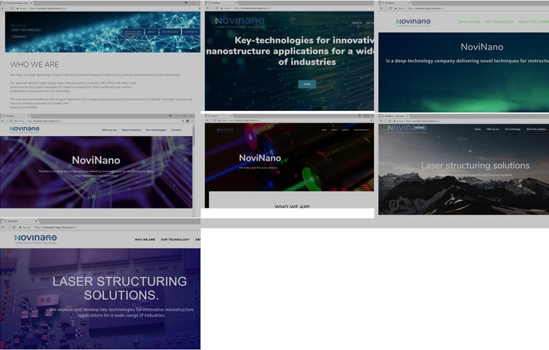

NoviNano
========

NoviNano is a deep-technology company delivering novel techniques for 
restructuring surfaces using femtosecond laser technology.

### Description

Here we have 7 versions of site of NoviNano.

The sites were developed with WordPress and each version is located
in corresponding folder.

### Dependencies

- PHP version 5.5.9
- MySQL version 5.6.33

### Installation

Every version of site is packaged through the plugin [Duplicator](https://wordpress.org/plugins/duplicator).

1. Go to [Releases pages](https://github.com/mplesha/NoviNano/releases) and download package (ends with \_archive.zip) and its installer (ends with \_installer.php)
2. Put them on your server
3. Create database for your project
4. Run installer through the server
5. Follow deployment steps

### Contributors
- Svetlana Bereziuk
- Marta Dziaruk
- Veronika Khlibyshyn
- Anastasija Kozubska
- Rostyslav Krukovskyi
- Mariana Nyshpor
- Taras Omelchuk
